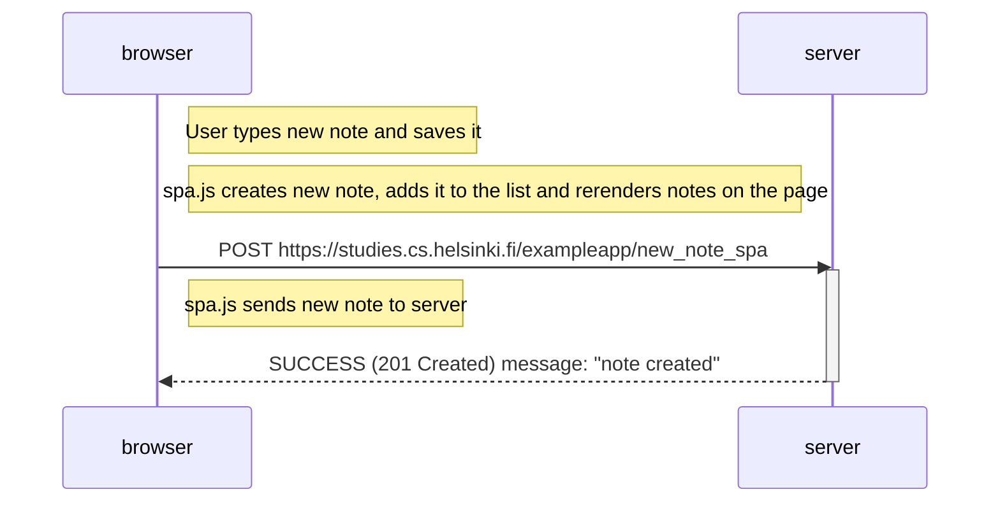

```mermaid
  sequenceDiagram
    participant browser
    participant server

    Note right of browser: User types new note and saves it
    Note right of browser: spa.js creates new note, adds it to the list and rerenders notes on the page
    
    browser->>server: POST https://studies.cs.helsinki.fi/exampleapp/new_note_spa
    
    activate server


    Note right of browser: spa.js sends new note to server
    
    server-->>browser: SUCCESS (201 Created) message: "note created"
    deactivate server
```